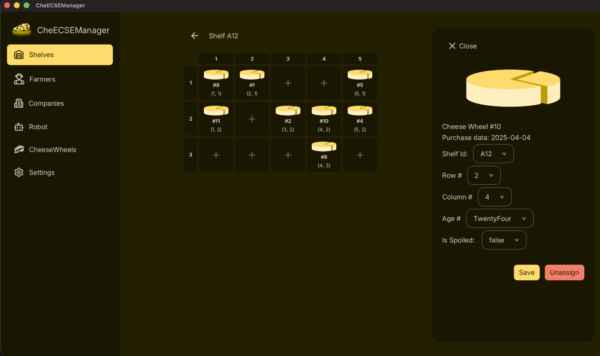

# 🧀CheECSEmanager

CheECSEmanager is a JavaFX desktop application that manages the flow of local cheese production from farmers to client companies. It provides an interactive UI to track cheese wheels, shelves, orders, and supply-chain operations.

## ✨ Key Features

- Manage farmers, companies, and cheese wheels (create / update / view)
- Shelf assignment & tracking (location, age, spoiled status)
- Ordering workflow from companies + inventory updates
- Reporting / dashboards for operational insights

## Tech Stack

- Java 21
- JavaFx
- Gradle
- JUnit 5
- Cucumber

## Demo

